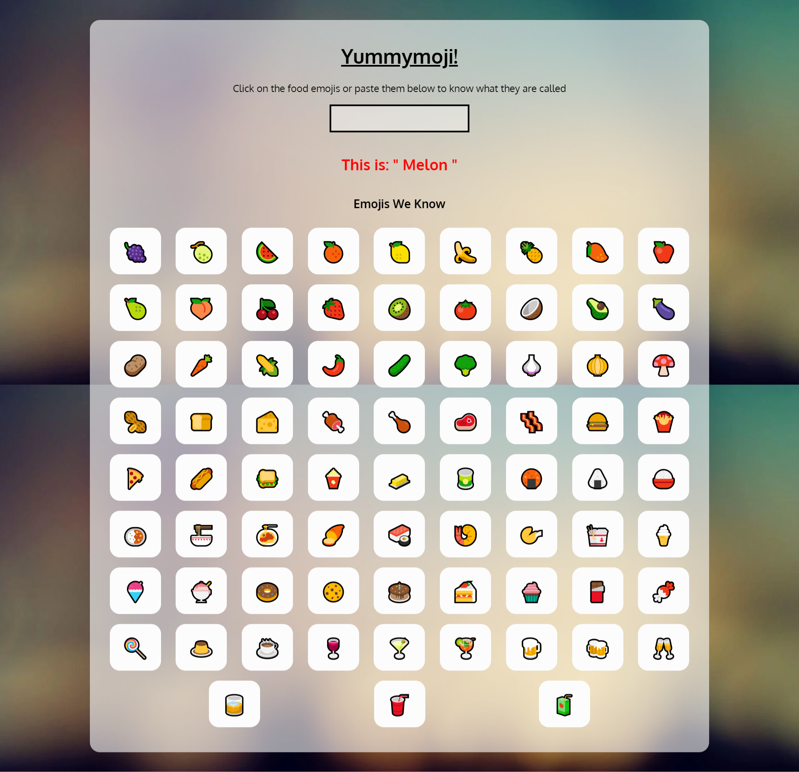

# Yummymoji-FoodEmoji-Interpreter

> This is my first attempt with ReactJS. 

Tried creating a Food Emoji Interpreter while attending Neogcamp (Web Dev Bootcamp) Level Zero. 
Created with CodeSandbox
